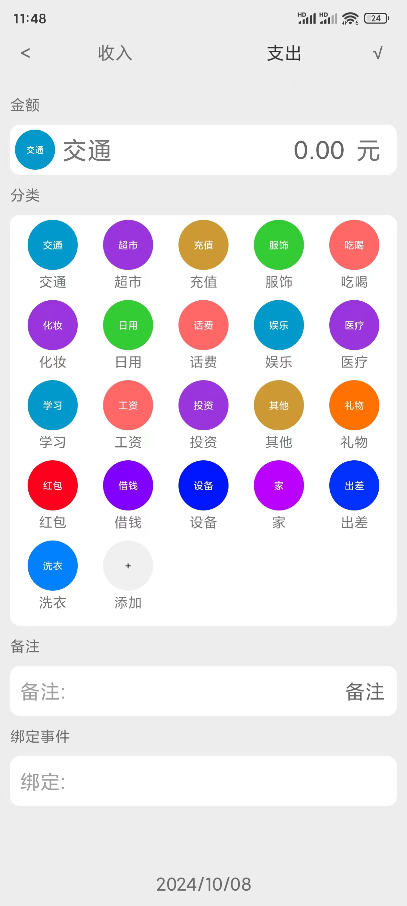
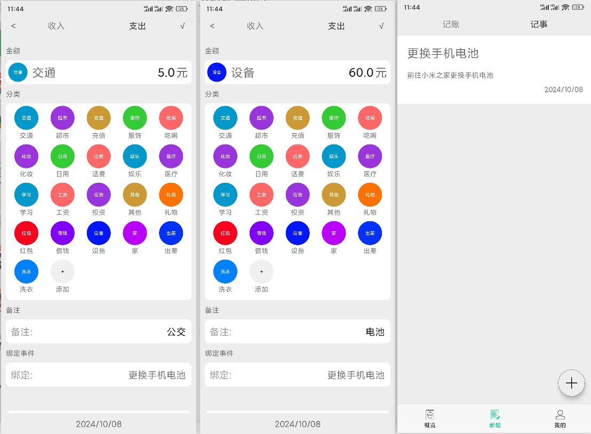

# 松果记账

## 应用背景

本项目旨在开发一款基于安卓系统的记账软件，以满足用户在日常消费中对账单管理的需求，其主要功能有：

1. **事件记录及账单与事件的相互绑定**：
    - 引入记事模块，允许用户记录更详细的账单相关信息。
    - 通过添加账单与事件之间的绑定功能，间接表示多个账单之间的联系。

2. **导入支付宝、微信支付账单**：
    - 添加从支付宝或微信支付等第三方支付工具导入账单的功能，方便用户整合多个平台的消费记录。

3. **其他实用功能**：
    - 新用户引导、用户基本信息管理、记账管理、记事管理、多账本管理、桌面小组件、搜索、账单导出、预算结余设置、图表统计、可自定义标签、云备份。

## 技术实现

1. **相关技术**：
   - Android平台、Java语言、Sqlite数据库。
   - 开源工具库：Android-FilePicker（文件选择工具）、EasyPermissions（权限申请工具）、MPAndroidChart（图表展示工具）。
2. **界面设计**：
   - 参考主流的UI设计，整体简洁、方便用户操作。

## 功能展示

### 添加账单

### 添加事件

### 账单与事件绑定

### 多账本管理

### 桌面小组件

### 预算结余设置

### 图表统计

### 自定义标签

### 云备份

云备份需要部署项目中的云端服务

